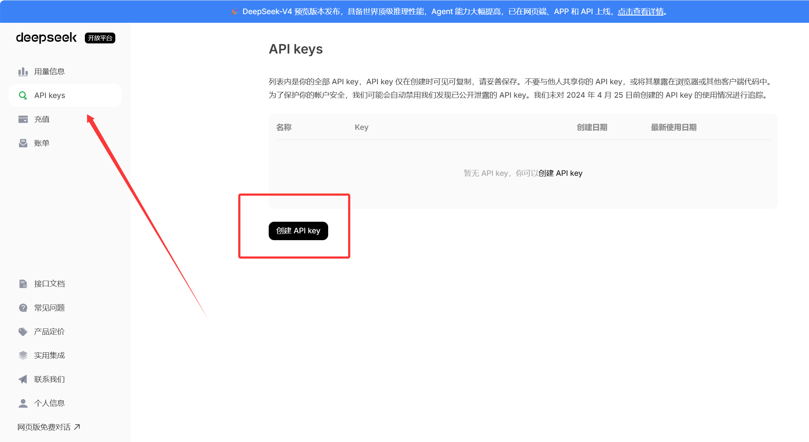
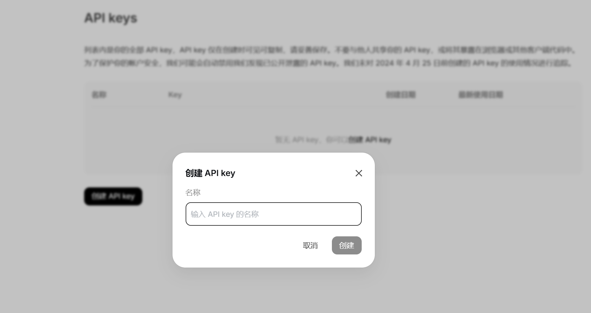
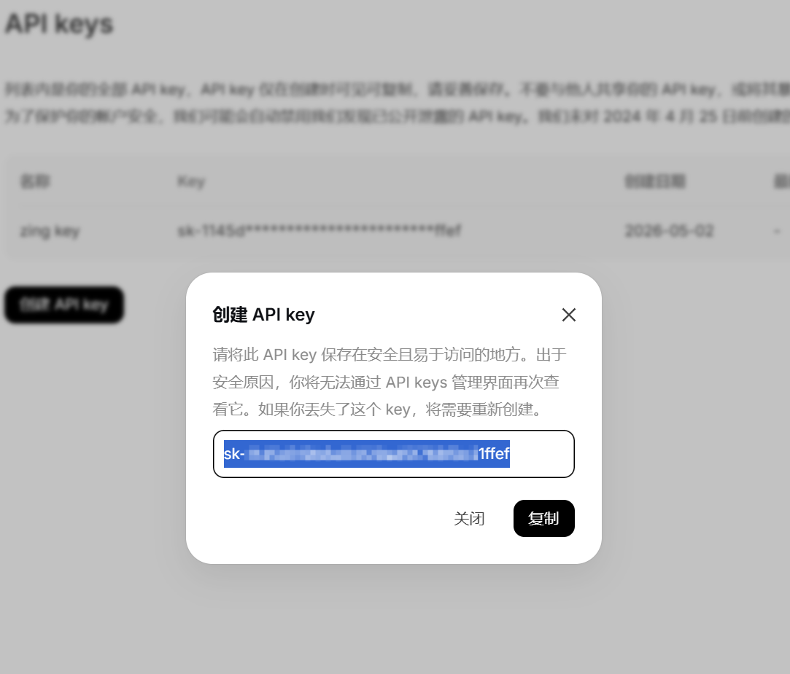
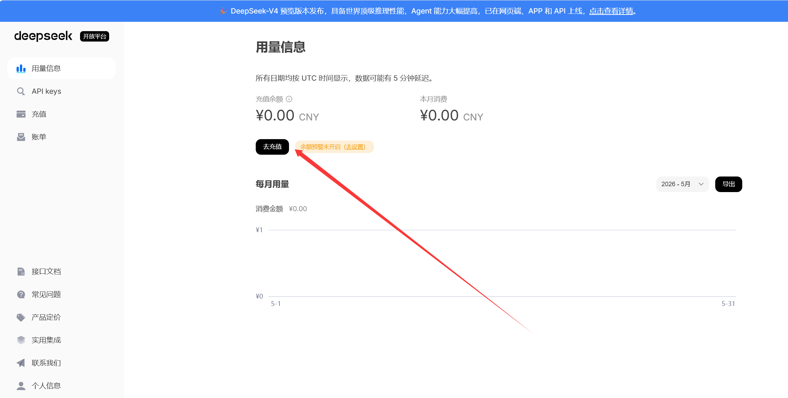

# API Key 配置

本程序提供了接入自备第三方 AI 模型（OpenAI 兼容）的功能，以应对填空/多项填空题，具体以程序内的选项为准。

此处以 [DeepSeek 开放平台](https://platform.deepseek.com/) 为例，说明获取 API key 的流程。

## 创建 API Key

- 以登录态访问 https://platform.deepseek.com/api_keys

- 点击 `创建 API Key` 按钮

- 给你的 Key 起一个名字，方便区分用途。注意 Key 的名称仅仅是为了给它打一个标签，并不是 Key 的实际值

> 这个以 sk- 开头的字符串就是需要使用到的 Key 值。
>
> **只会显示一次**，请及时复制保管，否则需要重新创建一个新的 Key

:::danger ⚠️警告
请妥善保管自己的 API Key，不要泄露给他人，否则会有钱包被刷爆的风险
:::

## 费用充值

虽然你平时在网页端、APP 内与各种 AI 对话通常是免费的，但如果要通过 API 接入到非官方平台的外部程序里是需要付费的。请务必先了解清楚所选服务商的费用和使用限制，避免不必要的损失！

但也别被“API 要付费”这句话吓到……像 DeepSeek 在处理简短填空题时通常是很便宜的，新手完全没必要上来就往里猛充 20 块钱。详情请见 [DeepSeek 定价说明](https://api-docs.deepseek.com/zh-cn/quick_start/pricing)

> 💡提示：1 块钱大约能让`deepseek-v4-flash`模型作答1.6万~2.4万道填空题

## 模型名称

`model id`字段需要填写官方文档中对应的正确模型名称，才能正常调用 API 获取答案。DeepSeek 的模型名称可以在 [官方文档](https://api-docs.deepseek.com/zh-cn/) 中找到：
- `deepseek-v4-flash`（✅适合简短填空题，速度快且价格便宜）
- `deepseek-v4-pro`
- `deepseek-chat`
- `deepseek-reasoner`

> *deepseek-chat 与 deepseek-reasoner 两个模型名将于 **2026年07月24日**弃用。官方出于兼容考虑，二者分别对应 deepseek-v4-flash 的非思考与思考模式。*

## 其他服务商（OpenAI 兼容）

如果你有其他 OpenAI 兼容服务商（如火山、阿里百炼等）的 API Key，需要手动填写`Base URL` `API Key` `model id`等字段，具体以服务商提供的 API 文档为准。

此处以 DeepSeek 为例给出接入第三方服务商的填写示例：
| 参数 | 值 |
| --- | --- |
| Base URL | `https://api.deepseek.com` |
| API Key | `sk-xxxxxx` |
| model id | `deepseek-v4-flash` |

> 大多数 OpenAI 兼容的端点地址会在 `Base URL` 添加 `/v1` 或 `/v1/chat/completions` 后缀
>
> 请以你所在服务商的 API 文档为准

程序内可直接选择 DeepSeek 作为 AI 模型提供商，无需输入`Base URL`字段。
