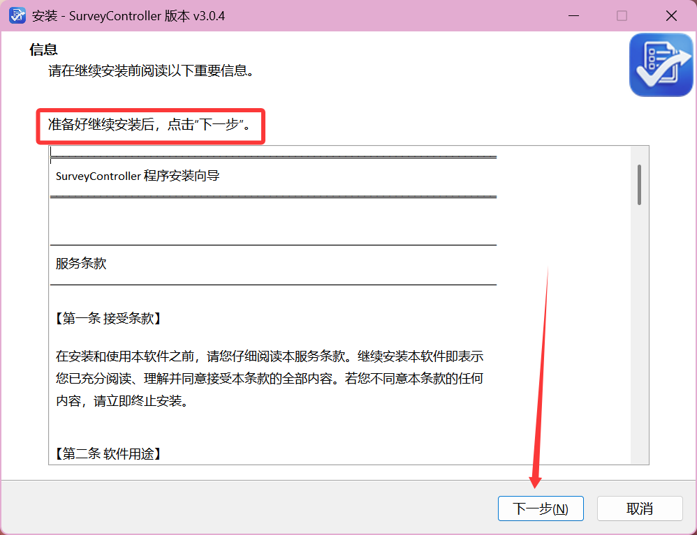
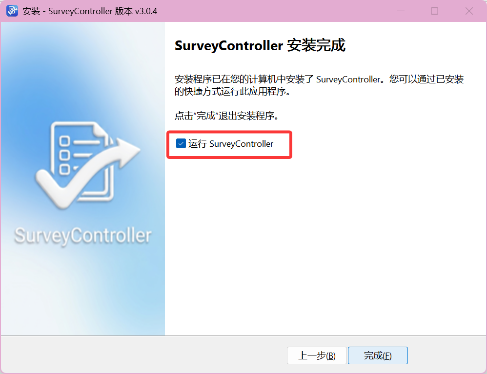

# 下载与安装

~~真的不想说什么了，个别人连下载都不愿意去尝试，看都不看一眼就开始说“不会用”。我劝这些人还是别做什么问卷了吧，闲鱼花点钱请个代刷省大家的时间不好吗。~~

代填￥20起，不包售后，欢迎咨询。👍

:::tip 提示
以下都是简体中文教程，不难的，你真的能看懂的
:::

## 安装教程

双击下载到的安装包（此处以v3.0.4版本的为例），按提示安装。

如果没有什么特别要求，大多数人保持默认一路`下一步`就行。

> **没有必要听信什么“安装到 D 盘”之类的营销号，除非你真的有这个刚需。**

## 启动程序

安装完成后，默认勾选运行SurveyController，即可进入主界面。

其实安装完成后桌面一般都会自动创建快捷方式。

要是没看到，估计你是那种把桌面当作默认下载路径的用户——你可能有必要仔细在灾后废墟一样乱的桌面上找一找了。实在不行，在开始菜单或许也能找到。

如果程序打不开，**请提供完整报错截图和信息**，再去群里或 GitHub 反馈！关于如何提问，请查阅 [提问指南](../support/how-to-ask.md)。
