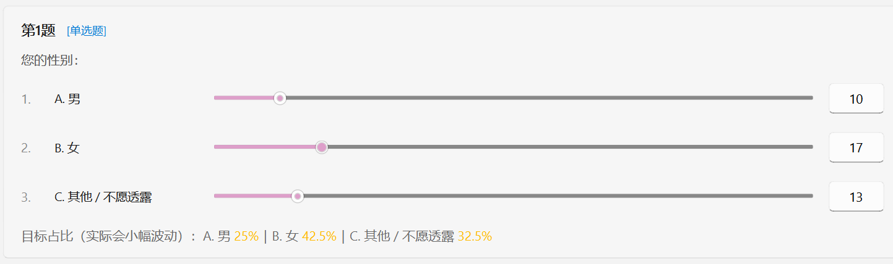
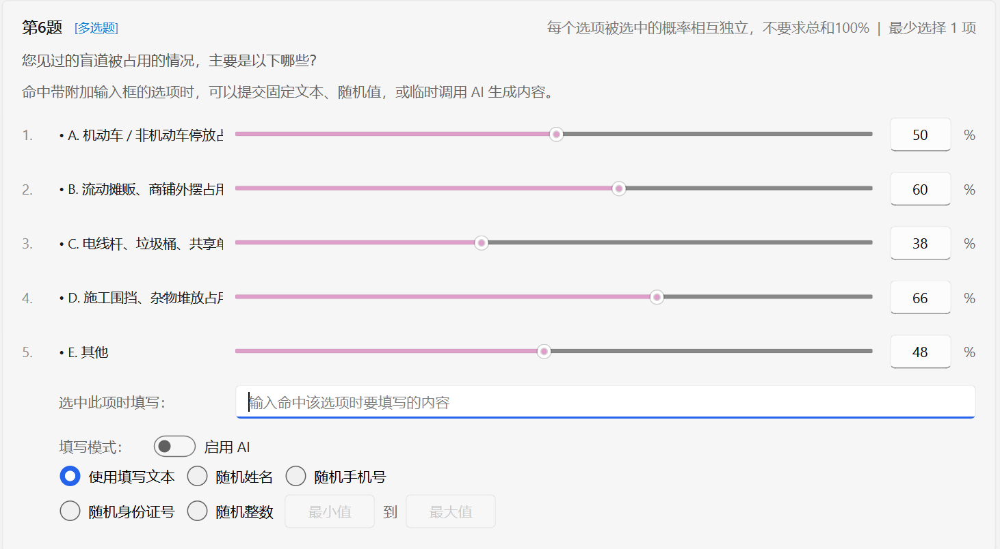
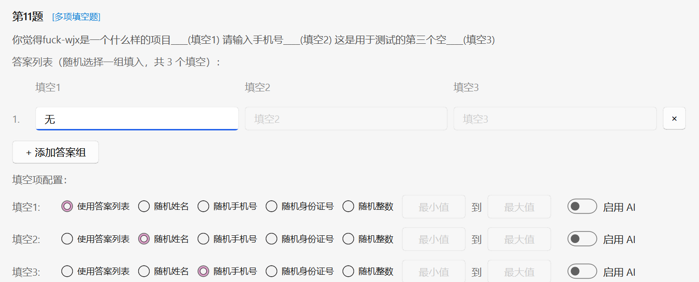

# 选项比例的配置

问卷解析成功后，程序会自动弹出一个便于你交互的界面，称为配置向导。

`自动配置问卷`会先帮你识别题型、跳题逻辑、分页情况。你需要做的只有动手`拖动滑块`或`输入数字`来调整每个选项的最终分布比例，其他的交给程序去实现。

下面简单介绍一下不同题型的配置逻辑

## 单选题、量表题、评价题
> 滑块对应值表示**各选项大概的作答数量比例**
>
> 每题下方的百分数表示每个选项预期的最终占比，可能会不准确，仅供参考

## 多选题
> 每个选项的概率是独立计算的，不需要你把所有选项的概率总和硬凑到 100%

*<small>（ 例如，明天会下雨的概率是 60%，气温超过三十度的概率是 70%，而 60%+70%≠100% ）</small>*

## 排序题
> 不需要手动配比例，程序会自动随机排序
>
> 针对`至少选择x项`的排序数量要求，程序会自动识别

~~<small>（其实是不知道怎么规划排序题的交互界面会更合适，干脆完全随机就懒得管了）</small>~~

## 填空题
> 你可以手动添加几条预设答案
>
> 程序会每次随机选一条填进去，但不能确保每个预设的答案都分别只用一次。

我们也提供以下几种类型的处理方式：

- 随机姓名
- 随机手机号
- 随机身份证号
- 随机整数
- AI 填空
:::tip 💡提示
随机处理的结果完全由程序随机生成，并非真实数据
:::

## 多项填空题
> 按“一整组答案”来配置，每个空对应题目中的一个填空位置
>
> 其余与 [填空题](#填空题) 配置逻辑相同

:::warning ⚠️注意
出于某些问卷设计者不看清题型就瞎搞的不负责态度

有的多项填空题可能只有 1 个填空位置，但是题型确实属于`多项填空题`的范畴。正常处理即可
:::

## 带跳题逻辑的题
没什么好说的，既然问卷里有这样的题目，肯定就有它存在的道理，剩下的就去咨询问卷的设计者吧

:::tip 💡提示
如果你正好是问卷的设计者，请你重新端正设计问卷的态度

遇到不兼容、不支持的的题型，最快的解决方法是，稍微小改一些题目类型，让程序能够正确适配
:::
