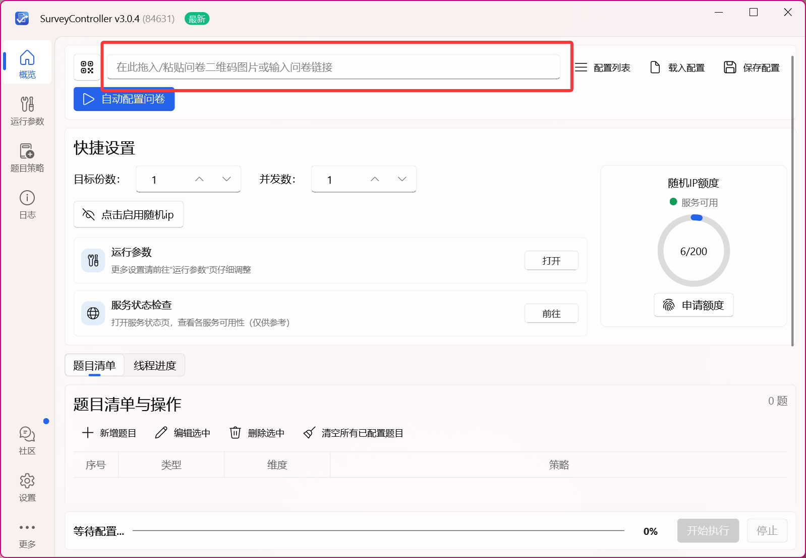
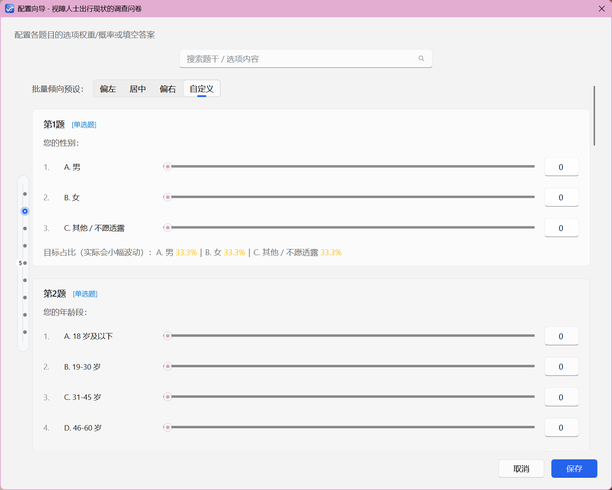
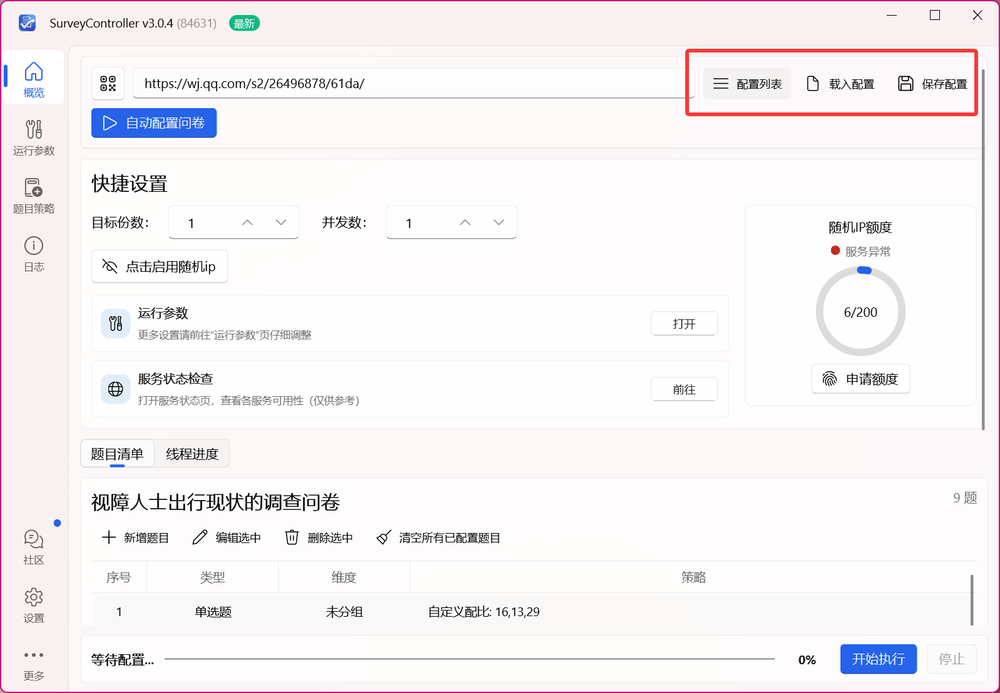
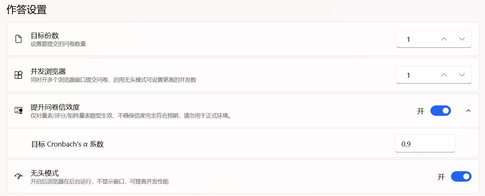
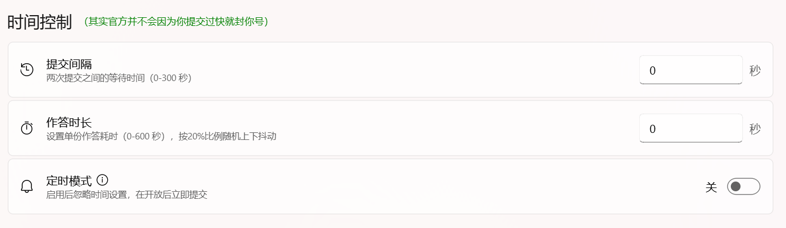
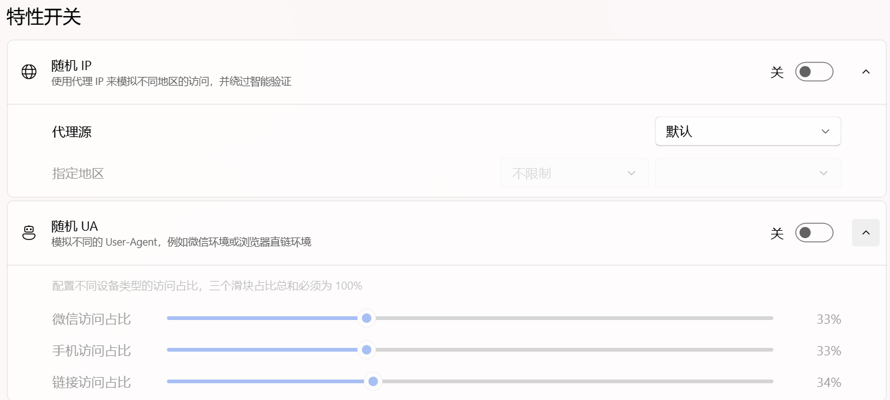
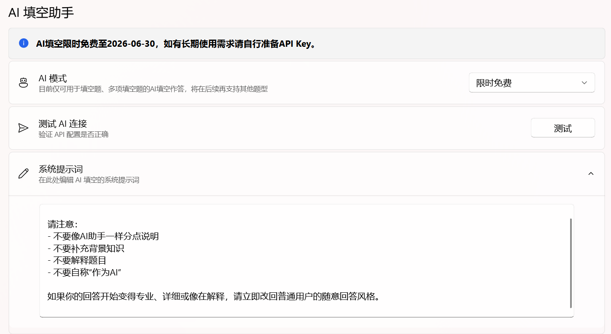

# 使用说明

本页演示了SurveyController导入问卷以及进入配置向导的具体详细操作流程，以及一些常见问题的解决方法。

## 导入问卷

打开程序后，你可以直接粘贴问卷链接或拖拽二维码图片到对话框中.或点击左边“上传问卷二维码图片”从文件中导入二维码，当然也可以直接自动配置问卷。

（二维码图片最好清晰一点，别糊成马赛克。）

## 进入配置向导

图片识别成功后，程序会自动跳到配置向导。

### 问题检查

如果识别没反应，先检查你传的是不是问卷二维码，而不是投票、考试，或者封面花里胡哨绣了几朵花之后塞个小二维码的抽象艺术。

右上角的“配置列表 / 载入配置 / 保存配置”是给你存档和复用配置用的。配置列表里暂时空白很正
常，说明你还没保存过。

## 配置向导怎么用

自动配置问卷会先帮你识别题型、跳题逻辑、排序题和下拉题。你真正需要认真看的，是那些滑块和
特殊说明。

- 单选题、量表题、评价题：滑块表示各选项大概命中的比例，每题下方也有数据比例显示。

- 多选题：每个选项的概率是独立计算的，不需要你把总和硬凑到 100%。（ 例如，明天会下雨的概率是 60%，气温超过三十度的概率是 70%，而 60%+70%≠100% ）

- 排序题：不需要手动配比例，程序会自动随机排序；如果问卷只要求排几项，也会尽量识别。

- 带跳题逻辑的题：如果把跳题选项概率拉太高，问卷可能会大批量提前结束，后面很多题根本做
不到。

- 填空题
普通填空题：你可以手动添加几条预设答案，程序会每次随机选一条填进去，但不能确保每个预设
的答案都分别只用一次。

  随机姓名、随机手机号：适合这种一眼就知道该填实名信息的题。

  

  多项填空题：按“一整组答案”来配置，同一行里的几个空会一起使用，别拆着理解。

  

  AI 填空不是必选项。你要是只想快点跑通流程凑够份数，能手填就先手填，别上来就想着跟 AI 死磕。具体怎么配置 AI 填空，仔细看文档，后面会说。

---

问卷信息都可以根据自己的需要修改，设置完成后点击右下角“保存”即可跳转到配置好的问卷份数设置。

## 运行参数

### 基础作答设置理解

- 目标份数：一共想提交多少份。

- 并发数：即同时开多少个线程齐头并进，快速提交凑够份数。新手别一上来就拉满，先保守一点，
性能好点的机器再慢慢往上加。轻薄本推荐 1~6 并发，游戏本或性能强劲的台式机推荐 4~12 并
发。

- 提升问卷信效度：量表、矩阵、评价这类题会共享同一份作答倾向，整体看起来更像真人。

- 目标Cronbach's α系数：仅供参考

- 无头模式：浏览器在后台跑，不弹窗，看起来清净一些，但要排查问题时不如可见模式直观。

**温馨提示：失败5次会自动停止和触发智能验证会自动暂停**（建议遇到阿里云智能验证先停下，默认建议开着，最好配合随机 IP 一起用。）

### 时间控制（不懂就先填0）

- 提交间隔：两次提交的问卷之间额外大概等待多久。

- 作答时长：单份问卷大概耗时多久。程序会在你设定值附近做一点随机浮动。

- 如果你只是先测流程，或者没哪个闲着蛋疼要求你展示后台的详细作答情况，这两项直接填 0 没有任何问题。

- 定时模式一旦开启，就会忽略上面两个时间设置，改成在开放后立刻高频刷新并尽快提交。它更适合抢报名名额、抢选课名额这类场景，不是日常刷问卷的默认选项。但是这个功能由于应用场
景稀少，并没有得到什么反馈。

- 如果你还开着代理，时间拉得越长，通常也越烧随机 ip 额度，所以别为了“像真人”就瞎拉到离谱。

## 随机Ip和随机UA（能用默认就别瞎折腾）

- 随机 IP 负责让访问看起来来自不同地区；随机 UA 负责模拟不同来源环境，比如微信、手机浏览器、
直接链接访问。

> 随机 IP：如果你不知道什么是自定义代理源、什么是 API 地址，就保持默认代理源。对于有使用自定义代理源刚需的用户，统一使用 HTTP(s) 协议和 json 返回格式。

> 随机 UA：三个滑块的总和就必须是 100%了，决定问卷后台更容易看到哪种来源占比。

- 如果你只是普通跑问卷，或者说无人在意你的问卷是哪来的，关了随机 UA 都行。

## AI填空助手（能用，但别把它当魔法）

- 如果你不知道什么是 API Key，什么是模型 id 编号，必须先阅读 AI 服务商的官方文档。

- 你要先选 AI 服务商，再填 API Key、模型 ID，最后点“测试 AI 连接”。别不按顺序乱来。

- 模型 ID 请按服务商文档写，别自己脑补一个看起来很像真的名字。（比如，DeepSeek R1 的模型 id 其实是 deepseek-reasoner）型 id 其实是 deepseek-reasoner）

- 系统提示词可以不改。想让回答风格更接地气，再自己慢慢调。

- AI 适合开放式填空题，不适合拿来解决所有问题。你问卷里如果只是几道简单填空，手动配置个“无”会更省心。或者，你干脆在后台把这题删了得了（

